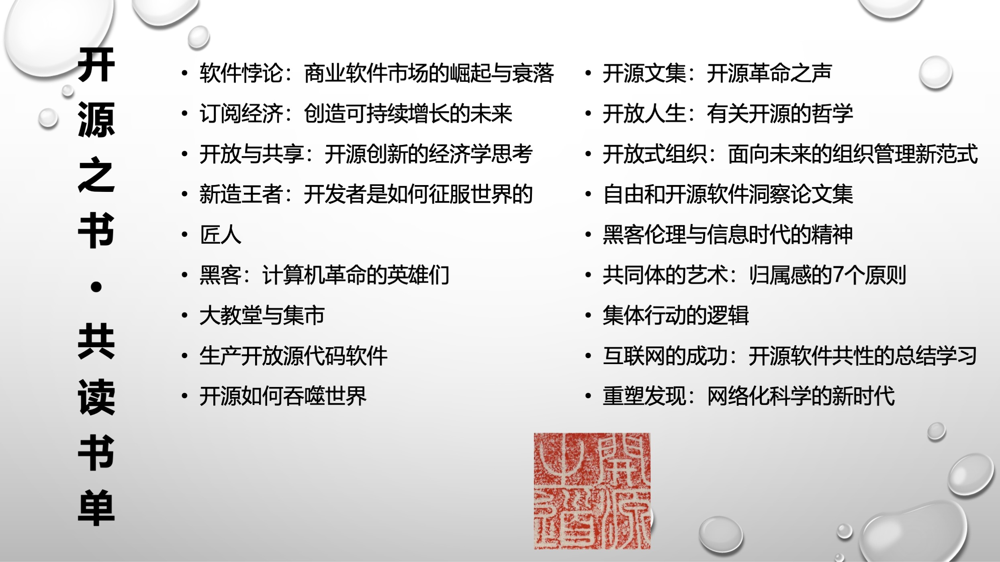
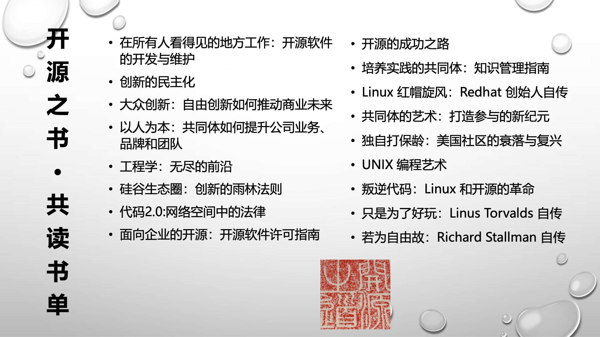
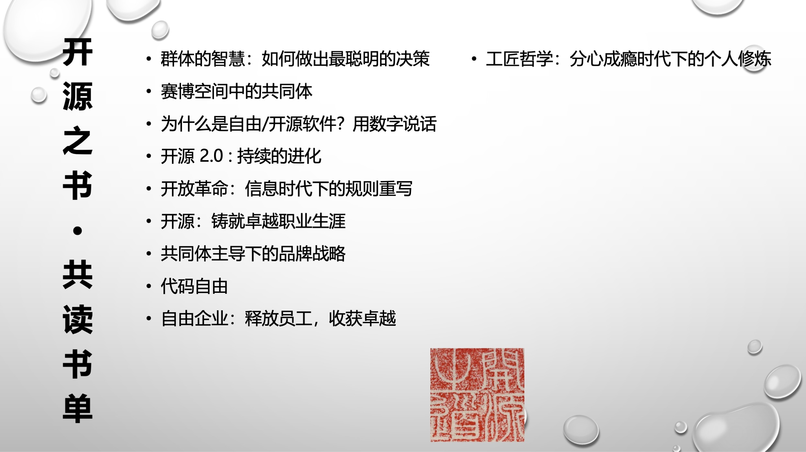

---
categories:
- 开源
- 感悟
date: 2021-05-27T15:12:06+08:00
description: "图书是一种以文字积淀的方式来对知识进行阐述的载体，一本书如果不读，那么它就是虚无的存在，对于作者没有任何意义可言，但是读，就将书再次激活，读者是作者的延伸，读者进而站在作者的肩膀上进行再创作。这就是读书的意义所在，当然读者需要建立在众多的沟通之中：和作者、和同是读者、以及读者的读者进行交流。"
keywords:
- Open Source
- Culture
- Reading
- News
tags:
- 每周精选
- 开源之道
title: "「黑客与开源」·「开源之书·共读」在开发者生态大会"
url: ""
authors:
- 开源之道
---

## 为什么开源要读书？

这是一个颇为让人好奇的问题，明明参与开源的大部分是开发者和工程师们的事情，毕竟这才是生产软件的核心力量。还有什么比源代码本身更能说明问题的？

当软件在这个人类的世界中发挥作用的时候，开源已经不止是开发者的事情了，它已经是这个世界的一份子了，再也无法割舍：

* 庞大的开发计划和难以统计的工作，这必然是一个工程的问题
* 分工就会产生利益分配，冲突解决，这也会是一个政治问题
* 大量的人有效的组织、活动、沟通，这也是一个社会问题
* 因为本身是技术，可以解决世上的问题，这必然也是一个经济问题
* 由于独特性，也会吸引人们的眼球，而这更是话题，媒体的追逐对象
* .......

而这一切，又需要积淀成为知识，才能让更多的人参与，进而进行待机更新。那么这必然不是可以通过一条途径来完成的。其中，书籍的撰写和解释，就像所有其它人类的知识一样，成为学习的主要途径。

如果仅仅是一个具体的计算机科学与技术方面的问题，那么也就去读相应的无数的项目和软件以及相关领域的图书就好了！就开源本身的书籍而言，作者极少，所以需要我们去整合和摸索。也需要众人以[开源之道](.)的方式来进行！于是「开源之书·共读」有了其自身的意义。

以下是「开源之书·共读」读过的和即将读的和开源上述知识强相关的书籍：

毫无疑问，这份书单会一直增长下去，因为开源正在不断的扩展其外延。

## 开源的核心是什么？

这是一个非常令人着迷的问题！ 也是让很多人困惑不已的问题。但是，这个问题和世界上的真理问题是一样的，比如什么因素是可以让人成功的？做什么可以让人实现巅峰？

开源，从诞生伊始，就一直被无数的人这么索问着！当然还有这个问题的变种：人们为什么在没有报酬的情况下做这件事？这些人们的动力或激励是什么？更加让人不可思议的是他们难道不为五斗米发愁吗？

也许是共性的问题，回答这个问题的答案，随着历史的发展，也在不断的丰富：

* 理想主义
* 技术至上
* 社群主义
* 礼物文化
* 黑客文化
* 商业战略
* .......

可谓是百花齐放，多姿多彩的诠释。正所谓不同的视角，得出不一样的内容。身处其中的从业者，会从书籍中寻找并理解，然后结合自身的境况进行解读。

例如：来自开源社理事长的庄表伟先生，近来痴迷于人类学对于开源的解释：

> 基于《大教堂与集市》、《礼物》等经典著作和自身开源实践的思考！回到人类学相关著作的源头，了解人类学领域对于“礼物”的看法，并反观开源社区对于礼物的理解。

而身处开源商业化数十年的龚仪先生则是从他自小就痴迷的黑客文化来进行叙述：

> 黑客故事以及黑客文化是我对自由/开源软件历史研究过程中最令我着迷的，但这种传奇式的精神在这个越来越网络化的社会中，是否能给个体生存和发展带来一些积极的影响和启发？在去年参加了卫Sir的读书分享活动后，让我对《黑客伦理》有了深入研究的意外冲动，黑客精神主张因为激情而工作，不被赚钱而奴役，这种自由我想简单的描绘成个体如何拥有“做自己想做的事情，不做自己不想做的事情”的自由！在经济发展为主的和平年代，个体免不了有“财富”的追求，究竟应该是为了实现“财富自由”却可能被迫失去自由，还是自由本来就比财富更可贵呢？我想借此引起大家的思考甚至是实践。

以及现场持其它观点的嘉宾。作为共读的必不可少的讨论环节，对于开源的理解有着更加多样的不同视野。如果你亲临现场，一定会忍不住表达自我，并对别人的视角产生质疑。那么争论便是我们所希望发生的样子！

2021.6.5 由 SegmentFault 思否发起的中国开发者生态峰会 （Developer Ecosystem Summit China ）在北京市北三环东路 36 号金隅喜来登酒店举办，专门赞助了「开源之书·共读」的Meetup，以上便是主要内容。当然，更为精彩的部分是你的参与！没有参与永远只是一个旁观者！期待你的到来，和我们一同感受开源的知识和思想，以及激荡的言辞表达。

## 本次「开源之书·共读」meetup 涉及到的图书

1. 《大教堂与集市》， [[美\] Eric S·Raymond](https://book.douban.com/author/802088/)，译者: [卫剑钒](https://book.douban.com/search/卫剑钒)，机械工业出版社， 2014-5
2. 《[黑客：计算机革命的英雄(二十五周年新版)](https://book.douban.com/subject/6860890/)》， Steven Levy ，机械工业出版社华章公司，2011-10-31
3. 《黑客伦理与信息时代精神》，[派卡・海曼](https://book.douban.com/search/派卡・海曼)，中信出版社，2002-9-1
4. 《礼物：古式社会中交换的形式与理由》，[[法\]马塞尔·莫斯](https://book.douban.com/search/马塞尔·莫斯)，商务印书馆，2019-2
5. 《新教伦理与资本主义精神》，[【德】马克斯·韦伯](https://book.douban.com/search/马克斯·韦伯)，北京大学出版社，2012-8

## 关于「开源之书·共读」 meetup 的背景介绍

原本基于互联网的分享，是不需要非的见面来沟通和交流，但是我们并没有进化到不需要社交就能够彼此信任的地步，我们仍然是社交动物，在这一点上我们和原始”村落“里的祖先没有任何的区别：

>  相比于线上的共读活动，「开源之书·共读」Meetup 旨在让对开源描述和解释的书友们构建信任、面对面交流和分享，提供更加高质量的学习反馈通道。也是开源共同体建设和维系的重要实践，期望为有志于做好开源这项工作的同行建立一个思考的精神家园。

自2020年7月以来，除非疫情不允许，基本保持在每月一场的节奏，北京居多，上海、杭州等地也陆续的有开源从业者和感兴趣者参与。