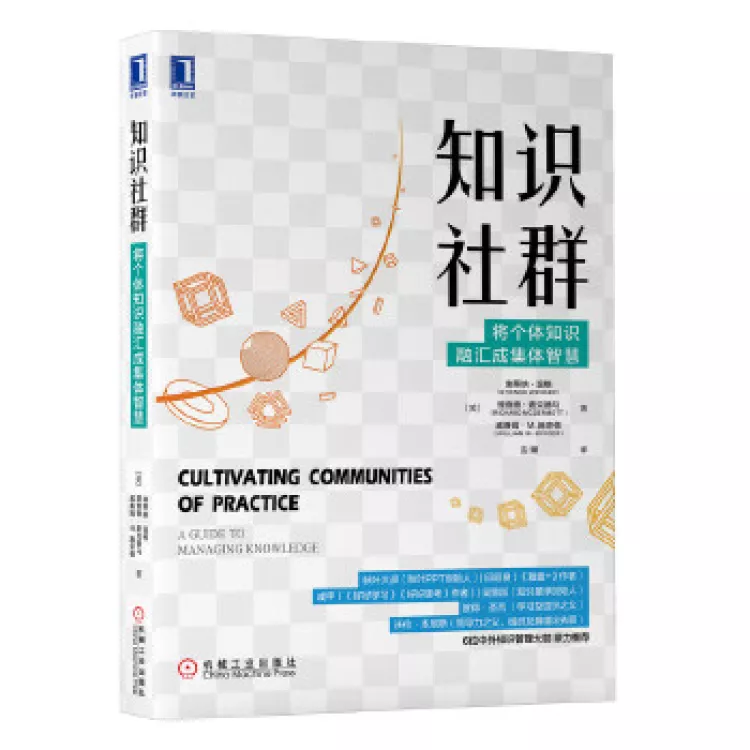

---
categories:
- 开源
- 感悟
- 读后感
date: 2021-01-21T09:38:54+08:00
description: "人们对于名词的理解非常的关键，观念决定行动，如果对一个词汇的解释和思考没有成为想法和观念，那么对于行动上就是迟缓而无所谓的。开源共同体究竟和你所从事的工作有没有休戚相关的共生关系？这取决于你对这个世界的理解和解释，也就是对这个名词的思考。"
keywords:
- Open Source
- Culture
- Reading
- News
- book
tags:
- 图书推荐
- 开源之道
- 图书共读
title: "开源之书·共读 2021-2：《培养实践的共同体：知识管理指南》 "
url: ""
authors:
- 开源之道
---

## 主题: 职业/学习共同体

### 书籍名称

英文：《Cultivating Communities of Practice: A Guide to Managing Knowledge 》

中文：《知识社群：将个体知识融汇成集体智慧》

#### 作者简介

埃蒂纳·温格（Etienne Wenger）

一位独立咨询师、研究学者、作家和演讲者。他是“知识共同体“（实践社团）研究的先锋，目前已经成为该领域内全球公认的思想领袖。他在理论方面做出了众多的贡献，在实践上曾帮助众多企业培养知识共同体。

理查德·麦克德马（Richard McDermott）是麦克德马咨询公司的总裁，近20年来一直致力于设计知识共同体。他积累了丰富的设计公司社群活动的经验，并亲自参与了多个知识共同体的启动与运行。

威廉姆 M．施奈德（William M. Snyder）

在组织发展领域已有将近20年的咨询经验，曾在麦肯锡公司从事战略性知识创造活动的研究，并与美国政府改革合作组一起，针对家庭卫生、公共安全和劳动力发展等社会问题发起了几个全美规模的知识社群。

#### 内容简介：

不可否认，知识共同体作为一种有效的学习组织形式，它突破物理距离限制，连接不同成长、工作背景人群，使共同体成员能够学习交流，碰撞出更多的知识火花。

然而现实残酷，社群很多时候无法达到应有的目标，意外状况频出。运营者需要系统掌握知识共同体的运营原理，才能高效运营管理，让知识共同体发挥出更大价值。

《Cultivating Communities of Practice》的三位作者曾辅导麦肯锡、壳牌石油、世界银行、施乐等众多知名跨国企业建立知识共同体，并从实践中提炼出知识社群运营的七大原则。这些原则，既适用于企业内部的知识共同体培养，又适用于当下因共同学习目标构建的微信群、知识圈子，以及知识服务平台。

**开源之道推荐短评：**

> 如果你对职业/学习共同体感兴趣，这是一本绕不过去的书籍，无论你读到那本书，它们都会引用本书的内容。开源共同体仍然是知识共同体的一部分，毫无例外。

更多内容，请参考完整版开源之道共读导读与书评：