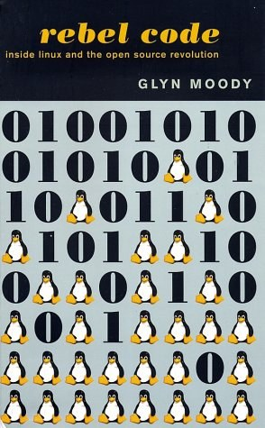
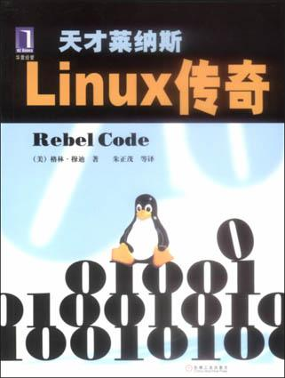

---
categories:
- 开源
- 感悟
- 读后感
date: 2021-05-20T14:18:27+08:00
description: "软件项目作为计算机专业技术的一个表达，其本身所累积的代码，对于绝大多数人来说，理解起来几乎是无比困难的，然而，围绕这个项目所发生的工程师们的故事却是可以引起人们的共鸣的，也就是开源共同体的人文的一面。而这也是开源项目之所以在工程上取得成功的重要原因，本书乃其中之典范也。"
keywords:
- Open Source
- Culture
- Reading
- News
- book
tags:
- 图书推荐
- 开源之道
- 图书共读
title: "「开源之书·共读」2021-06: 颠覆代码：Linux和开源的革命"
url: ""
authors:
- 开源之道
---

## 主题：文化与历史

### 英文名：颠覆代码：Linux and the Open Source Revolution

### 中文名：天才莱纳斯：Linux传奇 （俗不可耐）

### 

#### 作者简介

Glyn Moody， Glyn 的写作生涯始于1994年，从互联网开始，在第二年也撰写一些自由软件的文章，1997年，他为《连线》杂志撰文介绍关于自由软件和 GNU/Linux 方面的内容，在2001年，他出版了这本著名的图书《Rebel Code: Linux And The Open Source Revolution》，自那以后，他撰写了大量有关自由和数字版权的文章，同时也是一位撰写[博客](http://opendotdotdot.blogspot.com/)的能人，他的Twitter账户是：[@glynmoody](http://twitter.com/glynmoody)。

同时 Glyn 也在Linux Journal 上发表了大量的文章：[GLyn Moody 在Linux Journal](https://www.linuxjournal.com/users/glyn-moody)，这也是系统的了解开源的不错的路径，开源之道也曾经翻译过他的重要文章：

* [从科学的开放精神来看开源](posts/opensource_culture/open-science-means-open-source-or-least-it-should)

另外，Glyn 也对Linus做过深度的访谈，比如2012年在巴塞罗那举办的LinuxCon欧洲就非常值得一读：[Linus Torvalds访谈：我已经不读代码了](https://www.ituring.com.cn/article/17054)

#### 内容简介：

开源的神话传说里有很多迷人的故事，比如 Linus Torvalds, 从一名大学生到全球最重要的操作系统的Linux的掌门人，以及围绕Linux及其应用的成千个开发者的形形色色的经历。本书就是对这些幕后的Hacker们的访谈以及整理。

基于共同体开发的开源项目，如Linux Kernel ，Apache Httpd，等，其早期的发展，对于后来者来说简直是一个迷，甚至成了思考的背景，也就是说大部分时间会忽略它的存在，然而这样就会带来一个问题：对于开源的发展就难以做到彻底的理解。而本书作者，通过挖掘开源项目的邮件列表的对话，关键版本的发布，甚至是早期关键开发者的一些访谈，进而让读者能够对已经成功然而庞大的开源项目有一个更深入的理解，尤其是哪些难以体现在代码中的”逸事“。

#### 外文精彩书评

* 发表在卫报上的一篇重量级书评：[Rebel Code: Linus Torvalds, Open Source, and the War for the Soul of Software](https://www.theguardian.com/books/firstchapters/story/0,6761,471281,00.html)

**开源之道推荐短评：**

> 如何从人文的角度去讲述一个开源项目和共同体发展的过程，本书给出了最佳答案！后来者理应借鉴。

