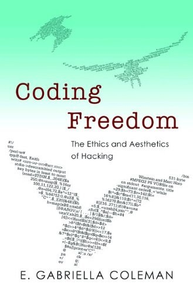

---
categories:
- 开源
- 感悟
- 读后感
date: 2021-05-25T11:05:51+08:00
description: "人类学家杨美惠在其经典著作《礼物、关系学与国家》中探讨过生活在恐惧文化中的人们是如何生活、思考和交往的，以及对于思想的交流。同样，著名的政治学者弗朗西斯·福山 也对信任的主题做过专著，开源的成功，往往要解决的第一个问题就是为什么要去做这件事？做了这件事对个体有什么好处？个人该如何思考？"
keywords:
- Open Source
- Culture
- Reading
- News
- book
tags:
- 图书推荐
- 开源之道
- 图书共读
title: "开源之书·共读」# 37: 代码自由"
url: ""
authors:
- 开源之道
---

## 主题：伦理、思想

### 英文名：《Coding Freedom:The Ethics and Aesthetics of Hacking》

### 中文名：《代码自由：黑客行为的伦理与美学》

（无中文翻译）

#### 作者简介

加布里埃拉·柯尔曼（E. Gabriella Coleman）本科毕业哥伦比亚大学，获宗教学专业学士学位。柯尔曼在大学时不仅沉浸于典籍书海，还对当时由Linux操作系统开发的免费软件产生了浓厚兴趣。与昂贵的微软和苹果相比，Linux提供的免费操作系统不受任何商品化软件限制，并且能使全世界计算机使用者拷贝、修改和分享源代码。此后柯尔曼在芝加哥大学继续攻读人类学硕士和博士，并曾计划前往圭亚那进行与灵性治疗有关的博士课题研究。然而，一场大病使她无法如期前往海外的田野点展开先期调研。这一变故使在柯尔曼养病期间得以重拾本科阶段的爱好，另辟蹊径，以因特网、聊天室和BBS为新的田野场所进行探索，了解与免费软件有关的讯息。出于研究需要，她还特意选修了与版权法和系统管理有关的课程。与此同时，她开始结交旧金山及其周边地区的极客（geek）和黑客（hacker），并且以义工身份进入电子前沿基金会（简称EFF），一个旨在保护因特网不受政府和企业控制的组织。在此基础之上，柯尔曼完成了以电脑黑客亚文化以及开源软件伦理为核心内容的博士论文。

在获得人类学博士之后，柯尔曼先后在美国罗格斯大学的文化分析中心和加拿大阿尔伯特大学科学、技术与社会研究部进行博士后研究，随后她在普林斯顿大学、纽约大学、哈佛大学和麦吉尔大学从事跨学科教研工作。2013年柯尔曼基于博士论文的代表作《代码自由》由普林斯顿大学出版社出版。在这部别出心裁的数码民族志中，作者的田野检视对象是一群网络技术最聪明的使用者。这群极具典型意义的“骇客”多为男性，其兴趣不只限于从事非法“黑客”活动。他们桀骜不驯，通过建立开源软件平台来维护他们的言论自由，并且在日常实践中策略性地与知识产权法进行抗衡，同时扩展和重构自由主义的理想。

#### 原书内容简介：

所谓的计算机Hacker都是些什么人？什么又是自由软件？那些致力于生产自由和开源软件的共同体的背后力量又是什么？那些以技术、美学和道德为目的进行Hacking 行为以揭示现代自由主义的价值观？本书在探索了自由和开源软件运动在美国和欧洲的兴起之后，详细介绍了Hacker们对于自由/开源软件的热爱，其背后的道德规范、指导hacker们辛勤劳动的社会法规、以及对于现有版权和专利法的质疑和反抗。本书所涉及学科范围颇广，包括计算机、政治学以及知识产权等方面的内容。

作者E. Gabriella Coleman 对Hacker 们日常的协作方式进行了全方位的跟踪，并细究了他们的宣言、特有的幽默文化、自由开源项目的治理、以及Hacker们的大型聚会活动。通过这些了解到的Hacker们的日常，Coleman 发现：Hacker 们改变了一些事，在坚定的内在驱动力之下，他们重新刷新了言论自由、透明、meritocracy等人类终极的理想实现，而且还做到了拒绝限制性的知识保护。此外，Coleman还生动地展现了被边缘化或者是常被误解的Hacker们是如何基于自由主义原则而进行的在线协作，最重要的是Hacker 们做到了可持续发展！

**开源之道推荐短评：**

> 开源软件是由开发者——社会人而生产的，必然涉及分工、利益分配、冲突管理等，这些本质必须被重视！本书做到了。

### 参考材料

[当代人类学视角中的“黑客”伦理与美学——以数码民族志《代码自由》为例](http://www.xml-data.cn/KXYSH/html/cd1210ed-f01d-4c3a-bddd-5778274aace8.htm#b2)

