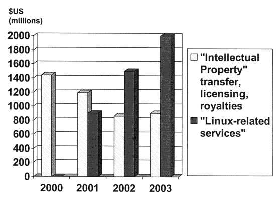

---
categories:
- 开源
- 思考
date: 2024-06-15T15:55:10+08:00
description: "历史往往就会和我们开大大的玩笑。适兕实在忍不住体验这个思维的实验,想象虚拟的历史，于是尝试花几个月的时间翻译。Enjoy！Happy Reading～"
keywords:
- Open Source
- Culture
- Reading
- book
tags:
- 书籍
- 开源之道
title: "《网络的财富：社会生产如何改变市场和自由》（中文版）(在线阅读) 第二章第一节"
url: ""
draft: true
authors:
- Yochai Benkler
translater:
- 「开源之道」·适兕
---

## 当前信息生产系统的多样性战略

事实上，在信息生产这个现实的经济领域，在过去的25年中，并不是人们想象中那么的依赖于产权和信息产品市场，尽管人们对“知识财产”日益痴迷。相反，我们从经验研究和理论研究中都看到的是：经济中的个人和企业利用各种策略来生产信息。其中一些战略确实依赖于专利或版权等排他权，目的是将信息作为商品在信息市场上销售。然而，还有许多战略并非如此。为了让这些战略能够更让人容易理解，我尝试勾勒出一系列理想型的信息生产 "商业 "战略。当然，本书并不是要详尽无遗地介绍实证商业的文献。我提供了一个简单的分析框架，在此框架内，我们可以了解企业和个人在信息、知识和文化生产活动中的时间、资金或两者投资的收益分配策略组合。区别参数很简单：成本最小化和效益最大化。任何一种战略都可以通过向现有信息的专有权所有者购买许可证的方式，利用已经拥有的投入（如歌曲的现有歌词或需要改进的专利发明）。这里的 "成本最小化 "纯粹是指理想型战略，即以零边际成本获得尽可能多的信息投入，而不是以正市场价格购买信息投入的许可证。可以通过使用公共领域的材料、使用生产者自己拥有的材料，或者通过共享/交换他人拥有的信息投入来换取自己的信息投入。利益的获得既可以依靠主张自己的独占权，也可以通过采取非独占战略，利用其他机制来提高信息生产者的地位，因为他们在生产信息方面进行了投资。市场行为者和非市场行为者都可以采取非排他性的利益最大化战略。表 2.1 列出了以这些要素为特征的九种理想型战略。

作为专利和版权基础的理想型战略可被视为 "浪漫最大化者（Romantic Maximizer.）"。

表 2.1：理想型信息生产战略

| 成本最小化/收益获取 |  公有领域  | 企业内部     | 交易/共享 |
| ----- | -------- | ----------- |----------- |
| 基于排他权(通过行使专有权--许可或阻止竞争对手--来赚钱） |浪漫最大化者（作家、作曲家；卖给出版商；有时卖给米奇）  | 米奇（迪士尼重新利用库存制作衍生作品；购买浪漫最大化者的产出）  | RCA（少数公司拥有封锁性专利；它们建立专利池，制造有价值的产品） |
| 非排他权的市场（通过信息生产来赚钱，但是不行使排他权）|学术型律师（通过撰写文章获得客户；还有诸如乐队通过免费的广告，然后举办演唱会来收费；软件开发者开发软件，但通过定制、一站式管理、咨询和培训等来收费，但不收取许可） |专业知识（公司能够实现低成本的开发和运营来生产）  | 学习网络（与类似组织共享信息 - 通过早期获取信息赚钱。例如，报纸联合起来创建通讯社；来自不同公司的工程师和科学家联合起来参加专业协会以传播知识） |
|   非排他也非市场   | 乔-爱因斯坦（免费提供信息，以换取地位、声誉、创新对自己的价值；动机多种多样。包括免费演出的业余合唱团成员、为出名而写文章的学者、撰写专栏文章、为邮件列表投稿的人；许多自由软件开发者和自由软件的被普遍采用） | 洛斯阿拉莫斯[^译者注]（在内部分享信息，依靠内部投入生产有价值的公共产品，用于确保更多的政府资金和地位）。） | 有限的共享网络（向少数同事发布论文，征求意见，以便在发表前加以改进。使用乔-爱因斯坦策略，利用时间延迟来获得相对优势。在正式互惠条件下分享自己的信息：就像 "copyleft "条件下的衍生作品发行一样）。 |

图 2.1： 2000-2003 年 IBM 部分收入

[^译者注]： Los Alamos ，美国二战期间，为制造原子弹专门的机构。