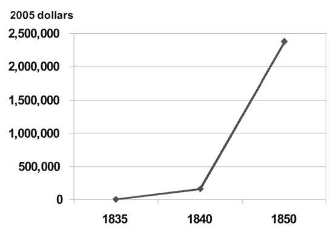

---
categories:
- 开源
- 思考
date: 2025-02-18T15:55:10+08:00
description: "历史往往就会和我们开大大的玩笑。适兕实在忍不住体验这个思维的实验,想象虚拟的历史，于是尝试花几个月的时间翻译。Enjoy！Happy Reading～"
keywords:
- Open Source
- Culture
- Reading
- book
tags:
- 书籍
- 开源之道
title: "《网络的财富：社会生产如何改变市场和自由》（中文版）(在线阅读) 第六章第二节"
url: ""
draft : true
authors:
- Yochai Benkler
translater:
- 「开源之道」·适兕
---

## 面向公共领域的商业大众媒体平台的出现

在整个二十世纪，大众媒体在自由民主国家的公共领域的建构中发挥了根本性的构成作用。在此期间，首先是在美国，随后在世界各地，商业性的、广告支持的大众媒体形式在印刷媒体和电子媒体中逐步占据了主导地位。有时，这些媒体所扮演的角色令人们称其为“第四权力”。在这里，媒体被视为政府进程的重要监督者，也是将社会运动的动员转化为突出的、最终可操作的政治声明的主要平台。然而，这些媒体也因其所拥有的权力以及未能拥有的权力，以及它们在向广告商出售眼球的正常业务过程中所促进的肤浅的公共交流而招致了无数的嘲笑。这一点在对电视在美国公共文化及其公共领域中扮演的巨大角色的批评中表现得最为明显。当代的辩论带有三大电视网的印记，在 20 世纪 80 年代初，这三大电视网仍然占据着电视观众的 92%，典型的美国家庭每天都会打开电视观看几个小时。这些富有灵感的作品，例如尼尔·波兹曼的《娱乐至死》或罗伯特·帕特南在《独自打保龄球》中声称，电视似乎是美国公民生活衰退的主要原因。然而，无论是积极的还是消极的，大众媒体传播模式的变体在整个二十世纪在印刷媒体和电子媒体中一直占据主导地位。在民主建立起来的整个时期内，大众媒体模式一直是民主国家及其专制对手的主导传播模式，民主首先是反对君主制，后来是反对共产主义和法西斯主义。说大众媒体占据主导地位，并不是说只有远程通信的技术系统才构成了公共领域的平台。正如西达·斯科波和普特南在美国和意大利政治背景下所追溯的那样，个人公民参与组织和协会构成了公众参与的重要平台。然而，正如两人所记录的那样，这些平台一直在衰落。因此，“主导”并不意味着独一无二，而是指在公共领域的结构中具有压倒性的重要性。网络公共领域的出现正在挑战大众媒体的这种主导地位，而不是其存在本身。

大众传媒当代产业结构的根源预示着我们今天所看到的媒体的吸引力和排斥的方面。17 世纪荷兰印刷商开创了商业印刷，无需依赖政府补助和印刷合同，也无需依赖教会，因此成为非正统文学和政治辩论的源泉。[2]然而，商务出版社也一直对市场条件——成本、受众和竞争——非常敏感。在十七世纪的英国，文具商垄断组织为其内部人士提供了足够的市场保护，使其免受竞争对手的侵害，以至于其成员非常乐意向王室提供顺从的出版业，以换取垄断权。直到这种垄断消亡之后，真正的政治媒体才真正出现，但随之而来的却是诽谤起诉、高额印花税以及政府公然的贿赂和收购。这些，就像革命前法国媒体所典型的更直接的审查制度和赞助关系一样，使报纸和公报相对顺从，并且它们的发行主要限于精英受众。政治异议并非稳定、独立的市场商业模式的一部分。正如保罗·斯塔尔所指出的，英国在美洲殖民地的发展情况有所不同。虽然在殖民地建立后的大约一个世纪里，报纸数量很少，而且大多是“授权”公报，但到了十八世纪，竞争开始加剧。尤其是在新英格兰，人们的识字率非常高，人口相对富裕，而且英国适用的监管限制（包括 1712 年的印花税）并不适用于殖民地。随着第二和第三报纸在波士顿、费城和纽约等城市出现，并且不再通过邮政专营权获得殖民政府的支持，公共领域变得更具争议性。现在，报纸就是一个公共领域，其声音是自我支持的，就像本杰明·富兰克林的《宾夕法尼亚公报》一样。在革命时期，这些媒体的大部分动员起来，以及人们普遍认为它在构成美国公众方面发挥着重要作用，使得商业媒体在革命后也能继续发挥独立和关键的作用，而法国大革命后媒体短暂繁荣的命运则不同。高识字率、政府高容忍度以及邮政补贴的结合，使得新兴的美国拥有其他任何地方都无法比拟的报纸的数量和多样性。到 1840 年，拥有 1,700 万人口的美国的每周报纸发行量高于当时人口为 2.33 亿的整个欧洲。1830 年，当托克维尔访问美国时，他遇到了一种普遍的阅读报纸的做法——不仅在城镇，而且在偏远的农场，报纸是政治结社的主要组织机制。[4]

这种发行量较小、大多是地方性的、竞争性的商业报刊的广泛发展，刊载高度政治性和协会性的新闻和观点，其面临的压力并非来自政府，而是来自机械印刷机、电报的规模经济，以及由铁路和工业化联系在一起的不断扩大的政治和经济团体。半个多世纪以前，哈罗德·伊尼斯 (Harold Innis) 就指出，机械印刷机成本的不断上升，加上其带来的发行量大幅增加，以及通过电报可以从世界各地传递事实信息的可能性，使得报纸逐渐转变为一种发行量大、成本相对较低的广告媒体。正如阿尔弗雷德·钱德勒（Alfred Chandler）以及后来的詹姆斯·贝尼格（James Beniger）在其著作中所展示的，这些内部经济与工业产出的大幅增长相互交织，而这又需要新的需求管理机制 - 换句话说，需要更复杂的广告来产生和引导需求。19 世纪 30 年代，《太阳报》和《先驱报》在纽约大规模出版，售价降至每份一美分，内容也从主要报道政治和商业新闻转变为报道新形式：来自警察法庭的轻微犯罪、人情故事和彻头彻尾具有娱乐价值的恶作剧。[5] 如图 6.1 所示，创办此类大众报纸的启动成本在十九世纪下半叶迅速增加。

图 6.1： 1835 年至 1850 年日报的创办成本（以 2005 年美元计算）

