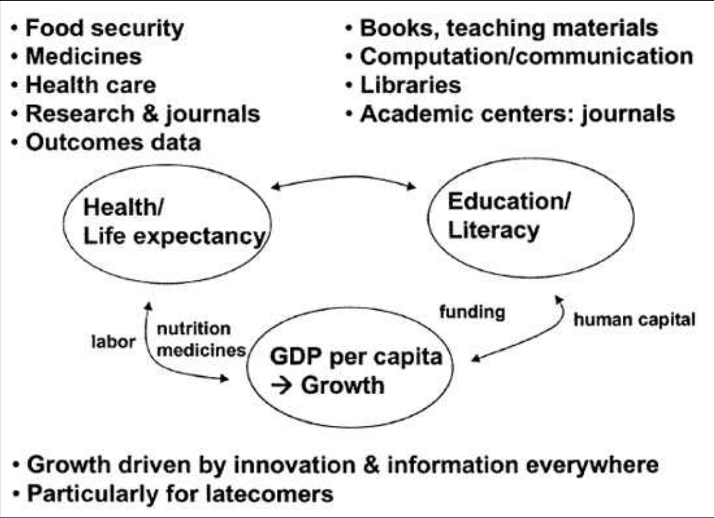

---
categories:
- 开源
- 思考
date: 2024-07-28T11:55:10+08:00
description: "历史往往就会和我们开大大的玩笑。适兕实在忍不住体验这个思维的实验,想象虚拟的历史，于是尝试花几个月的时间翻译。Enjoy！Happy Reading～"
keywords:
- Open Source
- Culture
- Reading
- book
tags:
- 书籍
- 开源之道
title: "《网络的财富：社会生产如何改变市场和自由》（中文版）(在线阅读) 第九章第二节"
url: ""
authors:
- Yochai Benkler
translater:
- 「开源之道」·适兕
---

## Commons-based 战略对于人类福利和发展

社会民主主义有着悠久的传统，它关注的不是自由社会中平等的理论条件，而是社会中人类的实际福祉。这种正义观念与自由主义理论一样，都承认市场经济是自由社会的基本组成部分。然而，其重点不是机会平等，甚至不是某种程度的社会保障，而是一种让懒惰者得以生存的保障。它强调的是确保社会中每个人都享有基本福利。特别是在欧洲社会民主国家，其目标是将这一基本福利水平提高到相当高，但即使是美国社会保障的基本框架，除非在未来几年发生根本性变化，否则也会具有这一特点。关于全球贫困及其减轻的文献最初与这一关注无关，但随着全球交流和意识的增强，以及大多数发达市场经济体中大多数人的生活条件的改善，对国内状况的关注与全球贫困之间的界限开始变得模糊起来。我们看到，人们的关注点越来越集中在对世界各地人类基本福祉的关注上。阿马蒂亚·森的作品最能体现这一点，他强调发展在世界各地的重要性，不仅是对正义的定义，也和自由有关。

全球发展作为分配正义的核心关注点的重要性日益凸显，这在很大程度上是基于世界大部分人口所面临问题的严重性。在这个世界上最大的民主国家，80％的人口（略多于美国和欧盟总人口数之和）每天生活费不足两美元，39％的成年人是文盲，47％的五岁以下儿童体重低于同龄儿童。在非洲最富裕的民主国家，新生儿在 40 岁之前死亡的概率为 45%。印度和南非远不是最贫困的国家。全球贫困的规模对任何可接受的正义讨论都产生了道德影响。直观地看，这些问题似乎太过根本，不会受到网络信息经济的严重影响——维基百科与刚果 49% 的人口无法持续获得优质水源有什么关系？在全球人类发展背景下，我们确实不应过分强调信息和通信政策的重要性。但同样重要的是，不要忽视信息对于我们大多数更先进的战略的核心作用，这些战略旨在产生福利和发展的核心要素。要了解这一点，我们可以从查看人类发展指数 (HDI) 的组成部分开始。

《人类发展报告》于 1990 年发起，旨在衡量一系列构成宜居生活和吸引力的要素。该报告的制定与以经济产出为中心的指标（如国内生产总值 (GDP) 或经济增长）截然不同，旨在更精确地了解一个国家经济和社会的哪些方面使其更宜居或更不宜居。它允许采取更细致入微的方法来改善各地的生活条件。正如森所指出的，中国、印度喀拉拉邦和斯里兰卡的人民比巴西或南非等人均收入更高的其他国家寿命更长、更健康。《人类发展报告》衡量了生活的方方面面。它追踪的主要综合指数是人类发展指数。人类发展指数试图捕捉人们长寿健康、知识渊博和拥有足够的物质资源来提供体面生活水平的能力。它通过结合三个主要组成部分来实现这一目标：出生时的预期寿命、成人识字率和入学率以及人均 GDP。如图 9.1 所示，在全球信息经济中，这些指标中的每一个都在很大程度上（但并非唯一地）取决于信息、知识以及信息嵌入商品和服务的获取情况。预期寿命受到充足营养和获得救命药物的影响。农业生物技术创新，以及种植技术方面的农艺创新和其他低技术创新模式，在提高社会自给自足能力和营养食品供应方面发挥了重要作用。药物依赖于药物研究及其产品的获取，医疗保健依赖于研究和出版，以开发和传播有关最佳护理实践的信息。毫不奇怪，教育也严重依赖于教学材料和设施的获取。这包括获取基本教科书、图书馆、计算和通信系统以及当地学术中心。最后，半个多世纪以来，经济增长一直被理解为主要由创新驱动。对于后来者来说尤其如此，他们可以通过采用其他地方开发的最佳实践和先进技术，然后根据当地情况进行调整，并利用通过这种方式获得的新技术平台，最快地改善自身状况。因此，这三个要素都受到信息、知识获取和使用的重大影响。网络信息经济的出现能够为人类发展带来巨大利益这一说法的基本前提是，我们产生新信息的方式——以及同样重要的，我们用来管理世界各地现有信息和知识存量的体制框架——能够对人类发展产生重大影响。

图 9.1：人类发展索引和信息 

