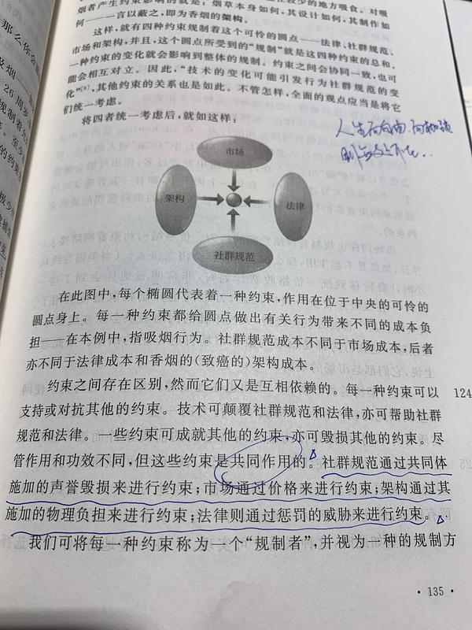

---
categories:
- 开源
- 感悟
- 读后感
date: 2021-01-17T16:28:25+08:00
description: "适兕是不是脑子出现障碍了？竟敢给著名人类学家、牛津大学教授推荐书籍。嗯是的，这就是一种开源的精神所在，非常明白这个世界没有全知全能的人，伟大的学者也有无暇顾及的领域，这个世界需要个体的无限平行协作。而不会落入俗套：资格论，看位置。不过我确实想让人类和社会学家来开源共同体中研究一下。"
keywords:
- Open Source
- Culture
- Reading
- News
- book
- review
tags:
- 图书推荐
- 开源之道
- 图书共读
title: "想给项飙先生推荐几本开源之书：对其最近一个演讲的回应"
url: ""
authors:
- 开源之道
---

## 项飙是谁？

项飙，1972年生于浙江温州，1995年在北京大学社会学系完成本科学习，1998年获硕士学位，2003年获英国牛津大学社会人类学博士学位。现为牛津大学社会人类学教授、德国马克斯·普朗克社会人类学研究所所长。著有《跨越边界的社区：北京“浙江村”的生活史》《全球“猎身”：世界信息产业和印度技术劳工》等。

2020年出版[把自己作为方法](https://book.douban.com/subject/35092383/)。

以上是常见的介绍，如果你深入了解他的话，会发现这是一名胸怀悲悯的学者，不走寻常路，不是传统意义上的书堆里的学者，而是践行人类学的要旨：**深入到当地的生活**，北大五年在北京南四环大红门的“浙江村”经历，也是没谁了，本科生就可以写出这样的人类学著作，也被中国社会学泰斗费孝通先生看上，不是没有道理的。项飙先生关注底层，即使人远在伦敦，也会关心中国，比如“悬浮”的提出，对东北下岗职工的迁徙关注等等。

就笔者而言，项飙先生的思路和视野非常的独特，常常给人耳目一新，关注人本身，对人性的关怀。

## [**《从“社会人”到“系统人”》**](https://mp.weixin.qq.com/s/tPRi-68y0253MP4bk3q86Q)

项飙先生在2021年初，接受了“腾讯科技向善暨数字未来大会2021” 的邀请，并做了主题演讲，项飙先生保持一贯的“谦逊”，但是却问出了当代中国高科技下的人文缺失：

1. 关于“系统”这个概念。从科技角度，从商务操作角度，或者从平台、公司日常管理的角度，你们会怎么对这样的一种社会存在状态进行定义？
2. 大家怎么看系统和劳动的关系？
3. 系统和使用者。其实劳动者也是系统的使用者，但是我们讲“使用者”的时候主要是指消费者。如果以外卖或快递为例，到现在为止，在全世界这个行业可能都是在赔钱、烧钱的。这么大的资本投入，究竟是在干什么呢？

## 项飙先生做客《十三邀》的疑问

作家许知远近两年做了一档谈话类节目，在2019年11月27日发布了和人类学家项飙的访谈：[十三邀丨人类学家项飙：现代人追求即刻满足 越来越情绪化和极端化](https://v.qq.com/x/cover/mzc00200c5sxk4p/o3026pze76s.html), 具体内容，看官可以自行进行观看，作者这里仅列出和本文有直接关系的一个疑问：

**一向以限制流动的中国，如户籍制度，在现代快递业和物流业高度发达的中国，是如何做到控制的？**

## 推荐图书及可能的答案

### 一、[《代码2.0:网络空间下的法律》](https://book.douban.com/subject/30276251/)

Internet 和 www 的出现、崛起，缔造了人类的互联空间，在这个新的空间中，发生了很多事情，一度有人认为在这里将成为完全崭新的无政府主义，国家将不复存在，如John Perry Barlow 所起草的《网络空间独立宣言》：

> 工业世界的政府们，你们这些令人生厌的铁血巨人们，我来自网络世界——一个崭新的心灵家园。作为未来的代言人，我代表未来，要求过去的你们别管我们。在我们这里，你们并不受欢迎。在我们聚集的地方，你们没有主权。

这是真的吗？现实世界的政府对于网络空间真的就一点作用就不起了吗？网络空间（cyberspace）是法外之地吗？要知道这个词的最早的涵义是来自于控制论。这就是矛盾是所在了：**对于一个旨在追求控制的架构，我们却大加颂扬其不受控制的特性，不免让人产生疑问**。

本书所探讨的就是网络空间从无规制的状态到规制状态的转变。全书分为五个部分：

*  第一部分：关于网络空间的发展轨迹，从“自由”到“自由”到消亡。
* 第二部分：理解网络空间的改变时如何发生的：是什么塑造了网络的自由，又是什么将改变这种自由？
* 第三部分：将上述问题带回到现实中：关于知识产权、隐私和自由言论，并确认其中为网络所改变的价值理念。
* 第四部分：继续将第二部分中的问题带入到国际化环境中进行讨论：网络无处不在，网民来自全球的各个角落。
* 第五部分：网络需要做出选择，作者对于整体的见解。

其中第二部分是本书的核心，也是花了最多篇幅来进行探讨的。尤其是提出的四大规制：

那么其中架构的部分，就是特别给项飙先生所推荐的，所谓的架构，也就是由程序员开发的代码所形成的，也就是说网络空间是一种人为的设计，可以制定一些类似物理世界的诸如山水这样看起来的规则，人必须逢山达路，遇水架桥。当然，作者从此引出的开放源代码坚定的立场，仅仅是和我们的共读小组的选择有关。

整体而言，对于没有受到过计算机、信息相关技术专业训练的人们，这本书是有非常之大的引发思考的作用的。希望能够解答项飙先生提出的“系统”，至少不至于是一个黑箱子。

### 二、[《大转换：重连世界，从爱迪生到Google》](https://book.douban.com/subject/26734748/)

尼古拉斯·卡尔是出了名的批判当今技术的思想家，前提是他确实看到了现象背后的本质，本书即是一例，能够将云计算比喻为交流电，似乎是所有人的普遍认知，但是，将计算结合起来，把托马斯·爱迪生和Google联系起来，那确实是空前绝后的思考。

我们所赖以工作和生活的电脑，正在变得集中化、万维控制化，你手里的智能手机、笔记本电脑都不过是个终端罢了。举例而言，搜索信息是我们非常普通的事情：

> 通过网络浏览器连接上Google 巨大的数据中心，输入关键字后，由千百台电脑组成的Google数据网络即会在几十亿个网页组成的数据库中搜索，选出与你的关键字最匹配的几千个网页，按相关程度排好序，并将结果通过互联网传到你的终端上——这一切通常只用零点几秒。

这本书或者可以解释项飙先生提出的平台的概念，计算正在变成一种公共服务，也即是说平台的成型，会在人的lifestream 中扮演一个日常的角色，浑然不觉。希望可以回答项飙先生的第三个问题，资本是一场知识的博弈，当争夺到平台之后，继续赚钱可谓是一劳永逸的事情，想要改变和切换，几乎是不可能的了，让一名现代人离开自来水和电力，将会如何活？

### 三、[《The Attention Merchants：The Epic Scramble to Get Inside Our Heads》](https://book.douban.com/subject/30194615/)

作为《总开关》的作者，吴修铭先生可谓是信息、通信科普思考的家喻户晓的人物了，那么这么关于注意力的书，可以说是一本简易的广告编年史了。从报纸的诞生，再到电视的崛起，再到互联网的电子邮件，然后到万维网的民主化，差一点就提及近两年火爆的抖音小视频了。

之所以推荐给项飙先生这本书，是想说明，精英们从来就没有放弃过抢夺普通人的注意力，利用虚构的、非虚构的、惊悚的、斯德哥尔摩症候群的、谣言的、夸张的、写实的、剧本的、临场发挥的......来让人们渡过自己浑然不觉的时间。在cyber世界可以影响到现实人类的情况下，市场是不会放过这个机会的。某种程度上是绝大多数人主动放弃了自己自主的时间。

人和“系统”，我的理解是人和网络之间的关系，正在产生变化：从WeChat 聊天到今日头条看自己想看的新闻，再到猎奇而短小浅薄的小视频，人们已经完全被网络所吸引。

### 四、[《Automate This: How Algorithms Came to Rule Our World》](https://book.douban.com/subject/25854872/)

今天，算法涉足的领域已经远远超出了其创造者的预期。特别是进入信息时代以后，算法的应用涵盖金融、医疗、法律、体育、娱乐、外交、文化、国家安全等诸多方面，显现出源于人类而又超乎人类的强大威力。

算法无处不在！

之所以想推荐给项飙先生这本书，是希望能够从公共的视野：股票买卖、电影订阅、娱乐消遣.....这些日常接触的事情，来琢磨背后“算计”的事情，某种程度上我们人都在算计，算计如何写一本书，算计如何赢得喜欢的人的芳心.......那么，人们的工作和生活被远在神秘的白色房间里的计算机集群算计，就没有什么神奇的了。

问题是，你要不要被算计？你有没有选择？或者说你要不要去算计别人？希望这本书能为项飙先生带来新的视角。

## 后记

项飙先生对于我个人有一定的影响，就是他的关于“认命不认输”的理念，这对于我一名小小开源布道师产生了很大的鼓励。我对自己的出身、上学、工作的状态，以及和现实的关系有着非常清晰的认知，但是我仍然要继续努力，奋斗至死！

当然其学术生涯的不走寻常路，也是值得赞叹和夸奖的。惊为天人～确实不为过。