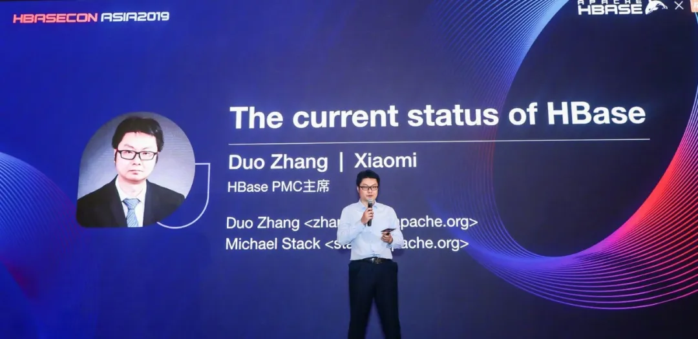

---
categories:
- 开源
- 感悟
date: 2020-03-06T10:27:16+08:00
description: ""
keywords:
- Open Source
- Culture
- Reading
- News
tags:
- 每周精选
- 开源之道
title: "Open Source in China! Article review 2020-03-08"
url: ""
authors:
- 开源之道
draft: true
---

### XiaoMi Open Source Committee，Build own open source culture

Origin Article：[小米开源委员会，打造自己的开源文化](https://mp.weixin.qq.com/s/NkpV4JPVo0p7zZBA6q4ypw)

**review:**

>In this xiaomi PR artcile, I am very interesting is zhangduo as HBase pmc chariman by voted. xiaomi said: have a sit of speak right. I never heard apache said this. even you are the main contributor. 
>
>Actually , Xiaomi is good about open source. at least cuibaoqiu  ,the VP of xiaomi, has said he used Emacs. 
>
>In China, open source is ridiculous, Only PR  open source is business company. has no community ,no non-profit foundation. 
>
>In the end of this article , xiaomi said will build community for open source. I don't know what's this meaning. maybe want to more free employee? or more partner ? or more consume people? wait and see.

### Open Source field 3 standard is successfully held online meeting 

Origin Article：[TC608工作动态|开源领域三项标准线上研讨会顺利召开](https://mp.weixin.qq.com/s/ayDdRydDaOCHOUxDuAoF0w)

**review:**

>As a member, opensourceway.community attend this meeting. Actually, This is about how to consume open source product without risk. for some entity of state-owned enterprise is important. 
>
>If you are open source developer or engineer , maybe don't think this is necessary, underestimate this statuation. China is low than your imagnation. 
>
>I don't want to explan more.	Chinese people try do their best to lerning Open Source, this is the clear path. As you know, some mistake or some fail is necessary. the important is we are try!

### Hack  for WuHan 

Origin Article：[决赛之巅 | Hack for wuhan黑客松舞台交给你](https://mp.weixin.qq.com/s/JBz1PyV9ur3nEUwuvQ3-TA)

**review:**

>WuHan, The **coronavirus** origin city, this city name stand for all people of wuhan and Hubei province, I never understand this action. the goverment "closed" the whole city.  forbid all people in or out. 
>
>Right now, someone lead this event. and a lot of copration and business sponors this event. Maybe you can find what they are doing. some useless infomation platform. 
>
>this is very sad. I kown these people want to do and what they think. but they did nothing. and goverment ask all people thanks giving ccp...... what the f**k.

