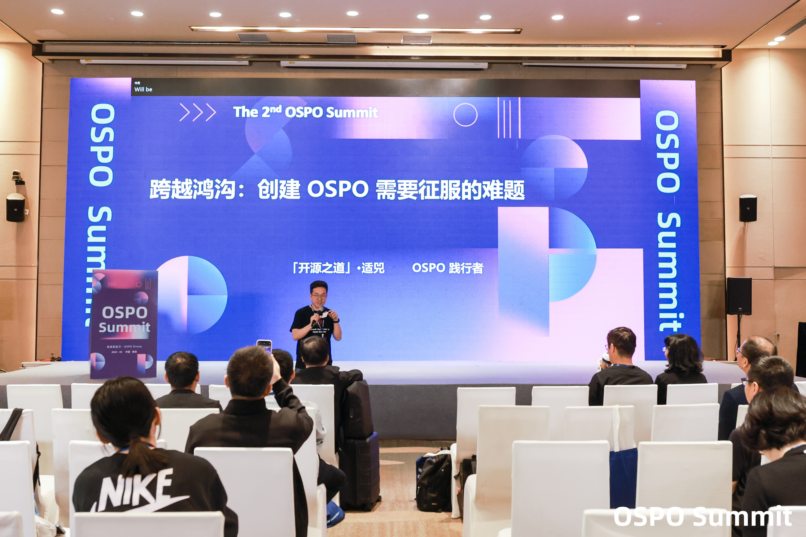
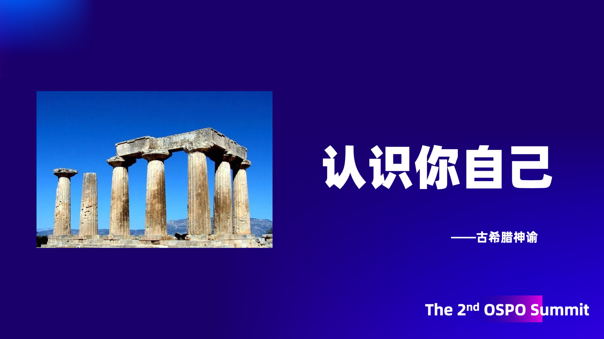
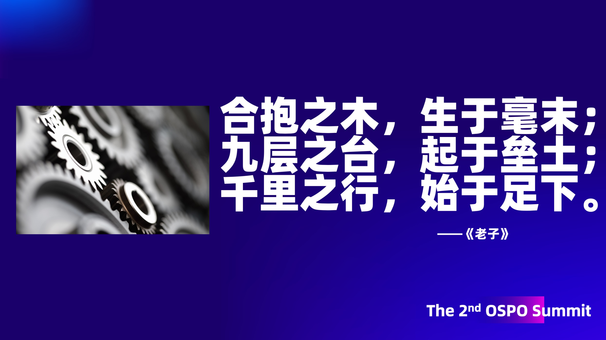
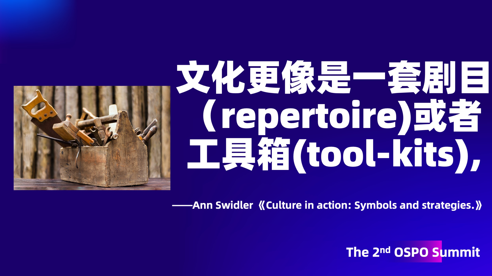
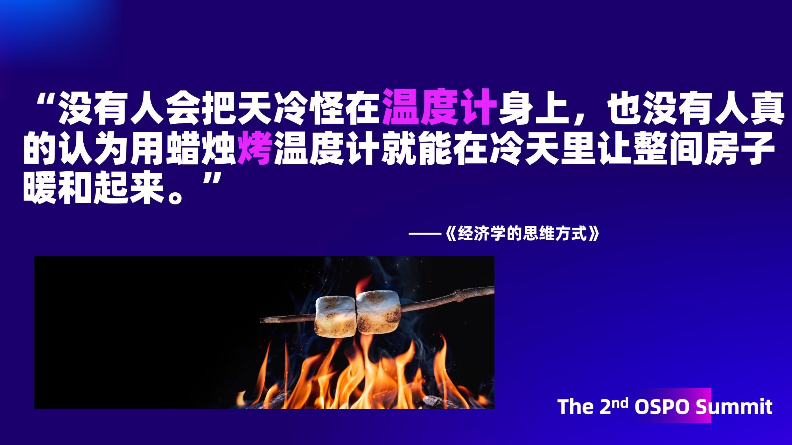
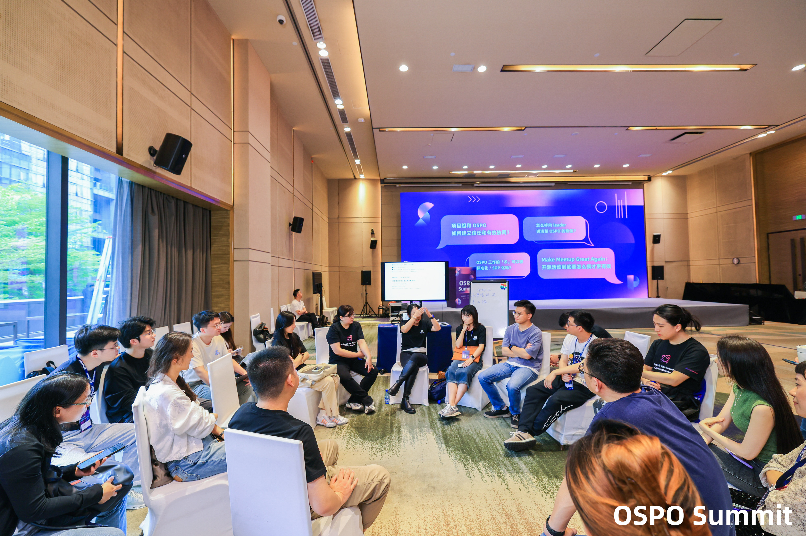

---
categories:
- 开源
- 感悟
date: 2024-03-24T10:16:26+08:00
description: "布道是个极为微妙的事情，兼具宣传与教育的双重属性，如果不够深刻，重复性的劳作，更快便让人们失去兴趣，索然无味，但是过于深刻，又远离了受众的认知，这大概就是很少见到布道者能够干超过2年的，即使没有人给负面反馈，自己也会觉得无聊，这个世界上没有简单的事情，除非一副无所谓的样子。"
keywords:
- Open Source
- Culture
- Reading
- News
tags:
- 每周精选
- 开源之道
title: "跨越鸿沟：征服创建 OSPO 的难题 （第二届OSPO Summit 演讲分享） "
url: ""
authors:
- 「开源之道」·适兕
---

“道”，其实一直以来都不是一个受欢迎的词，「开源之道」走过这几年，确实很少被人关注，但是，不能因为受众小，就不去做，我是非常佩服本届主席们的内容安排的。我可能是今天所有嘉宾中最配合安排的，是真的讲OSPO的大道理的:-)

我们一直都知道，开源的供给与需求是不成比例的，但最新的调查研究《the value of open source software》[1]显示给出了我们准确的数字比例：5%:96%，$4.15 Billion（十亿） :$ 8.8 万亿 ，而今天来到我们第二届 OSPO Summit 现场的OSPOer，差不多也是整个市场的1%都不到，虽然我们乐观的看到有巨大的提升空间，但是不得不说 OSPO 并不是那么容易创建，希望我个人的观察和经历，能够让更多的人参与到这个极具潜力的市场中来，给大家以鼓舞，共勉。

了解自己非常的重要，不仅是指我们个体，也指我们的组织，无论是企业还是教育机构，以企业为例，离不开商业的考量，决策层们更多的是以年度销售额、成本等为考量的，开源作为企业的一部分，不能只是工程师之间的技巧实现的对话，而是要翻译为：“为企业节省了多少成本？”；“为新产品上市加速了多长时间？”；“为企业培育和招募到多少人才？” 等等这样通用的组织术语，OSPO的创建如果无法和他们以这样的方式对话，那么基本上是不会被认知的，而我们要做的还差很多，我可以现场做一个调查：

> 请今天来到现场的财务、人力资源相关的朋友举个手～ 谢谢！

是的，和我预料的一样：没有！

接下来这条，可能会让现场的朋友有些不舒服，近来，我们经常会听到一个词叫“出海做合规”，每每听到这个，我都感觉到一阵深深的羞愧，这句话的另外一个意思是：在本土是不需要做合规的，没有合规，那么人们就会肆无忌惮的违反各类许可，进一步也在违反社会契约，那么开源是断然不会被正视的，离开了合规的约束，开源项目办公室的存在也毫无意义，甚至是一种障碍。

计算机软件是一种工程技术，开发者、工程师所做的工作，都是建立在前人的基础上的，没有人可以做到完全是从零开始做起的，那么拥抱开源，就要谦虚，要承认自己是建立在开源的基石之上来开发的业务应用，只有做到了这点，组织拥抱开源才能迈出坚实的第一步。

在布道OSPO的历程中，我见过太多的急于求成者了，总是想着跳跃式发展——跨越OSPO阶梯[2]，从最低点一跃而上，成为开源的领导者，所有的尝试者都以失败告终，草草收场，没有例外。我想在这里劝告大家的是，但凡有点政治常识，就明白1998年开源这个词汇被发明时的状态：Linux、apache、Perl、Sendmail、Python.......每个项目和共同体都有自己的特色，他们形成的联盟，进而形成了我们现在看到的开源世界，想在这个已然成熟的世界中脱颖而出，应该像我们现实中做任何事一样，脚踏实地的走好每一步，一步一个台阶的走，容不得半点侥幸。

时间过得真快，我需要加速来完成这次分享了，文化像工具箱，并没有否定马克斯·韦伯的“轨道论”[3]，也就是说工具不是轻松的信手拈来，而是需要大量的实地练习才能做到的，我们常常看到的情形是：在组织内谈开源文化，在共同体谈企业文化，这样的悖论式的总是说对方是合理的情形。文化是要做到才能有效的。

最后一个话题，我们做事需要衡量指标，这是非常重要的，但是不要为了追求指标而做一些浮于表面而欺骗自己的事情，项目的重要性，不是star数决定的，star数仅供参考，真正重要的仍然是解决现实的问题，可惜，我们常常在现实中看到这种一味追求表象的做法，闹了笑话，还浪费了时间和精力。

希望这几条看起来简单，其实一点也不难的道理，能够帮助到更多的组织建立开源项目办公室，能够从开源中获益！祝大家好运！

## 参会的一点记录

两天一夜的大量知识、经验和实战分享，对于个体来讲实在是智力上的考验，也是让自己的记忆力的惋惜，我已经记不起什么了，不过总结下来可以归结为几句话：

> 加速OSPO的建立，对于开源的发展以及组织的受益是双赢的事情，无论是否有实际的部门，都需要做开源相关的事：合规、知识财产法、协作、节省成本、创新、共赢！

最让笔者印象深刻的还是非正式会议之：**Make Meetup Great Again！**

* 要以受众的收获为主要目标
* 内容为王是永不过时的做法
* 有人文关怀的细节怎么强调都不为过
* 要有新式的契合当前年轻人的风格
* 活动的意义对于组织者本身而言至关重要
* 线下的活动更重要，尽管相比于线上需要更多的资源

## 参考资料

1. Hoffmann, Manuel, Frank Nagle, and Yanuo Zhou. "The Value of Open Source Software." Harvard Business School Working Paper, No. 24-038, January 2024.
2. https://todogroup.org/resources/studies/ ，最后访问：2024.4.4
3. 《儒教与道教》，（德）马克斯・韦伯，江苏人民出版社，2003-08

## 关于作者

「发现开源三部曲」（[《开源之迷》](posts/book-of-open-source/the-fascinating-of-open-source/)，《开源之道》《开源之思》。）、[《开源之史》](posts/history-of-open-source/summary/)作者，「开源之道：致力于开源相关思想、知识和价值的探究、推动」主创，开放原子开源基金会资深顾问，Linux基金会亚太区开源布道者（2022/2023年度团队主席）， 云计算开源产业联盟OSCAR（中国信息通信研究院发起)个人开源专家，OSPO Group 联合发起人。
