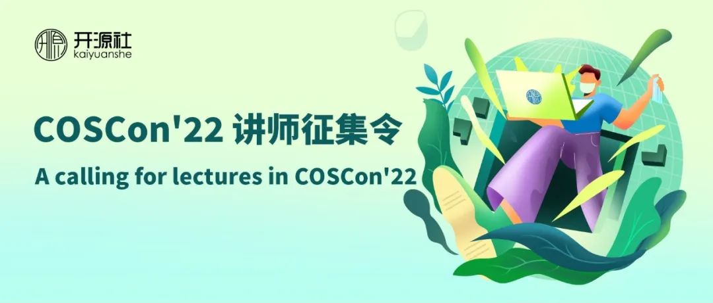

---
categories:
- 开源
- 感悟
date: 2022-07-11T11:27:06+08:00
description: "「开源之道」·适兕非常荣幸的能够出品COSCon'22「开源·文化」分论坛，随着开源被主流的接受，越来越多的公司、个人参与进来，大家也开始寻找集体行动的逻辑最为根本的内容：文化的重要性。这么看来，我们仍然是站在前沿，关注未来动态的先行者与布道者。"
keywords:
- Open Source
- Culture
tags:
- 开源文化
title: "文化的落地与冲突 —— COSCon\'22 开源文化主题 "
url: ""
authors:
- 「开源之道」·适兕
---

> “父为子隐，子为父隐，直在其中。
>      —— 《论语》

# 如何反观自身的文化

当我们去动物园游玩，或者是迪斯尼环球影城玩耍，亦或是在农家乐睡土炕，都是一种体验和平日里不同的方式，开源世界里日常和生活于其中的人所思所行[1]，并不是大多数人的日常，从软件开发的角度来讲，大多数从业人员还是在封闭的、有限的区域环境中所言所行。“只缘身在此山中”，会让我们对自己的言行浑然不知，而对于和自己有着巨大反差的开源文化，则表现的更多的新奇，能够有机会体验一把，会感觉良好。

换句话说，如果一个人不能在开源的世界里生活和工作过，就无法彻底的理解开源，也就是谈不上正确的认识开源。

## 开源中最为容易接受的部分

开源缘起于计算机软件开发当中的源代码能否被所有人获得，也就是说开源的成果之一就是能够在计算机上运行的软件，作为技术的实现，这是容易被人接受的，即使不去考虑技术的价值中立，人们也很容易的知道这些代码是可以解决现实中遇到的问题的：驱动一台计算机、搭建一个web服务、存储一些信息、分析自己认为有用的数据...... 换句话说，就是那些能够解决我们现实中遇到的问题：信息问题为主的技术是最直接有效的被接受的，因为它可以显著的提高人的方便、舒适、省力、省心等，让人从苦力和疲劳中解放出来的技术。

但是，这是一个舍本逐末的接受，也就是说开源真正强大的地方，并不是它最终的产出，其最强大的地方是其对与数字知识财产的全新分配方式[2]，开源所解决的集体行动的逻辑，以及对于现代数字化世界的影响是至关重要的，这就是在几十年之后，中国政府将之纳入到国家级的规划中[3]的重要缘由。在此我们可以明确的看到，规划中倡导的并非技术的部分，而是让人难以接受的部分。

## 本土拥抱开源的文化困境与解决之道

从费孝通先生的经典《乡土中国》[4]到许烺光先生的《美国人与中国人》[5]，都从比较的角度探讨了本土文化发展职业共同体的难度，在差序格局之下，是无法发展出软件开源的项目共同体的，一定会将网络的外部性[6]放弃，而回到一个只有熟人的封闭空间，最后由于亲力亲为的人不断减少等问题，项目无法持续。

从知识财产法的角度[7]去思考本土的关于开源许可的掌握和执行，当在人们的观念中普遍存在于一种秩序就是逃避惩罚的时候，那么显然开源的许可对于本土的意义是虚空的，尤其是互惠性许可的倡导与发展，如果不能将之视为一种礼物，那么就无法融于和从项目中受益，因为开源许可的哲学意义在于协作，如果不协作，则永远不会成为开源的一分子，而只是外围的搭便车者。

再就是关于信任，在开源的世界，所建立的信任是现代的法律至上，而很多学者都证明过中国的信任机制更加依赖于政府[8]，然而，开源组织与机构的形成，又完全是一个自下而上形成的社会团体[9]，政府的作用相对更为弱影响，只需要监管财务的来去，那么如此巨大鸿沟的难题就摆在我们面前，政府将扮演重大的角色，该如何扮演？

改革开放快速发展的40多年，人们经历了前所未有的物质丰裕和线性增长，似乎金钱资本成了大家唯一争取的，而忽略了精神世界的构建，对于本土的IT行业来讲，尽管是赚钱最多的行业之一，但是996、大厂内卷、35岁危机等让人焦虑不安，而这些是与开源世界中所倡导的黑客精神[10]、匠人[11]精神是相去甚远的，在开源世界的工程师应该追求良质[12]，要去抵抗成为 KPI 的现代组织人[13]，把项目做好、做下去才是首要目标。如此的心理建设和社会氛围，实在是太考验人了。

我们正在寻找和挖掘，旨在让更多的本土工程师认识开源文化，加入到开源的世界，如果你对上面的话题感兴趣，诚邀您提交议题来分享。

## COSCON'22 「开源·文化」分论坛征稿范围

* 本土文化中最适宜开源的部分
* 本土文化中和开源有冲突的部分，以及解决之道
* 说明文化对于开源的重要作用
* 那些能够影响开源走势的部分
* 开源世界的日常和价值观
* 以及您认为最值得分享的关于开源文化的内容

 更多关于第七届中国开源年会（COSCon'22）的内容，同时也是提交议题的入口，请点击下面图片了解更多。

## 参考资料

1. 《开源之迷》，适兕，人民邮电出版社，2022-02
2. 《开源的成功之路》，Steven Weber，外语教学与研究出版社，2007-6
3. “十四五”规划纲要全文发布 『开源』被首次列入！https://blog.csdn.net/kaiyuanshe/article/details/114909256 ，最后访问时间：2022-08-24
4. 《乡土中国》，费孝通，北京大学出版社，2012-10
5. 《美国人与中国人》，[美] 许烺光， 浙江人民出版社，2017-11
6. 《网络社会》，[荷]简·梵·迪克 ， 清华大学出版社，2020-5
7. 《窃书为雅罪：中华文化中的知识产权法》，（美）安守廉，法律出版社，2010-11
8. 《生老病死的生意：文化与中国人寿保险市场的形成》， 陈纯菁，华东师范大学出版社，2020-10
9. Neither Market nor Hierarchy nor Network: The Emergence of Bazaar Governance，Benoît Demil & Xavier Lecocq，Organization Studies (01708406); 2006, Vol. 27 Issue 10
10. 《黑客伦理与信息时代的精神》，派卡・海曼（Pekka Himanen），中信出版社，2002-9-1
11. 《匠人》， [美] 理查德·桑内特，上海译文出版社，2015-7
12. 《禅与摩托车维修的艺术》， 罗伯特•M.波西格 (Robert M.Pirsig)，重庆出版社，2011-9-1
13. 《组织人》，[美] 威廉姆.怀特，北京大学出版社，2020-7