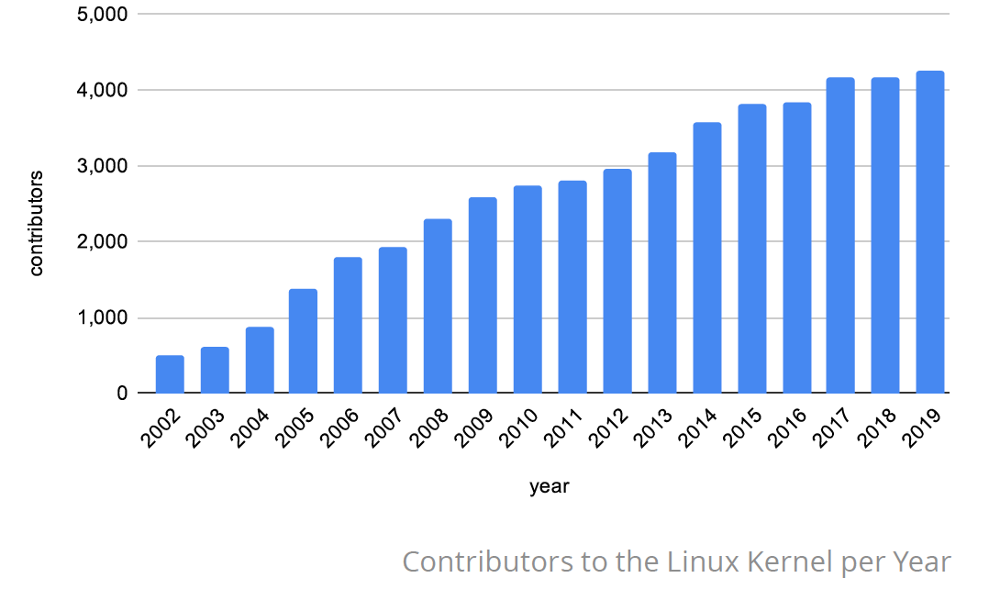
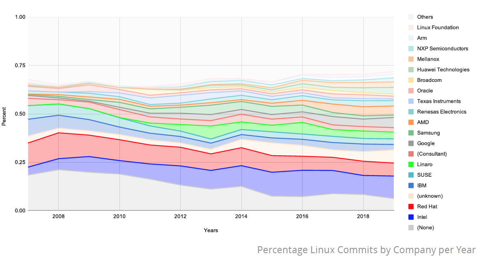
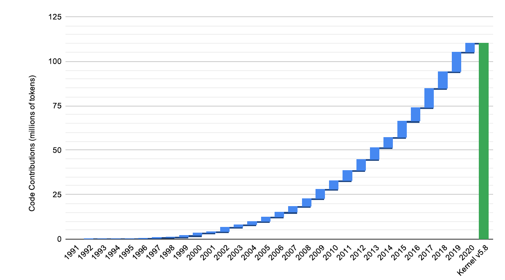
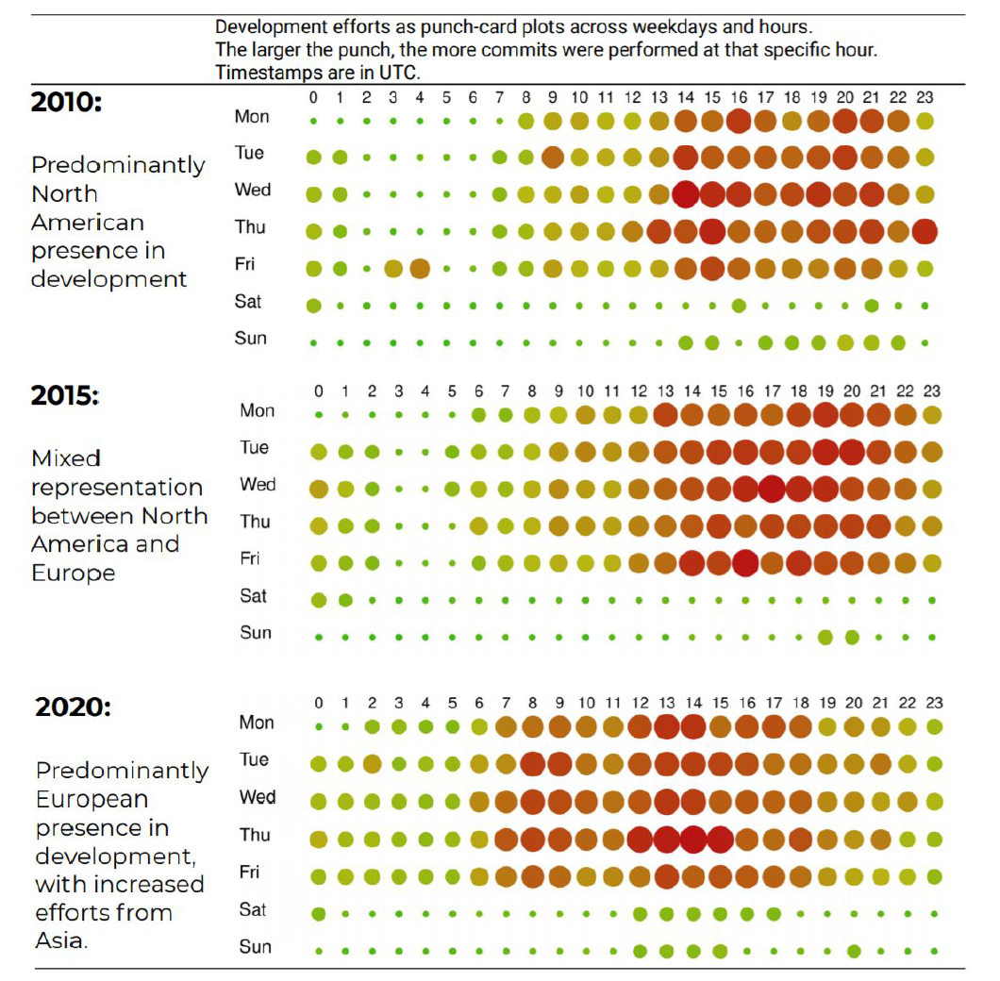
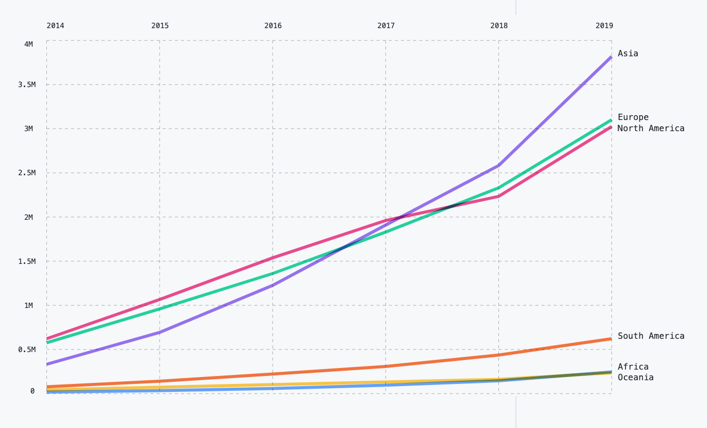

---
categories:
- 开源
- 感悟
date: 2020-09-01T14:48:37+08:00
description: ""
keywords:
- Open Source
- Culture
- Reading
- News
tags:
- 每周精选
- 开源之道
title: "请保持清醒：开源是唯一和世界同步的机会！"
url: ""
authors:
- 开源之道
---

# 请保持清醒：开源是唯一和世界同步的机会！

## 引子

近来网上流传了一篇贬损开源的文章，题目非常的政治化：“我们对开源软件最大的误解，就是以为它不会被美国断供”。这是一篇劣质、低级、无知的文章，我不愿意进行任何的评论。

我最大的愤慨莫过于我朋友圈的转发和一些我认为对开源还算了解的人的群内讨论，一些压抑的消极的东西顿时难以克制。但是平息之后，觉得又没啥大不了的，这种认知上的偏差算是很正常的现象。不如回到自己的内心，将一些事情捋一捋，或许能让明白事理的人点头称道。

## 软件只是开源的一小部分

我们通常讲的开源，其实指的是代码的那部分，而不是软件的那部分，因为开源的本质其实是不包括软件的那部分内容的，有了代码之后，将代码编译为软件，软件不过是一个附属品罢了。

代码作为信息时代的典型产物，是体现着工程师的劳动结晶的，有着知识的所有特征，比如在撰写、创作的时候是需要花费很大的精力和能量的，而copy 的时候，是不需要丝毫力气的，而且无限。但是，代码有一个非常特别的属性：它是动态的、生长的，一旦没有人维护，它就会被历史所淹没。

在本土讲开源的故事的时候，会有一个脍炙人口的故事：[宫敏博士从芬兰用软盘背回来一整个Kernel的源代码](https://www.infoq.cn/article/opensource03)，那么这个源代码和操作系统有什么样的关系了呢？

### 从 kernel 到发行版，需要走很长的路

仅仅有 Kernel 的源代码，对于用户和非kernel开发者而言是毫无用处的，那么到可以使用的软件又会经历什么了呢？让我们不妨从发行版的角度来看一下，都要经历哪些：

Kernel 本身的运行需要编译器，通常使用的GNU C，我们以最简单的[LinuxFromScratch](http://www.linuxfromscratch.org/lfs/view/stable/chapter03/packages.html)为例，想要搭建一个Kernel的编译环境，需要如下项目：

* autoconf
* automake
* bash
* binutils
* flex
* .....

每个项目都是必不可少的，成千上万行代码所组成，单独拎出来除了学习几乎没有任何的现实意义。然而进一步想要可用，如桌面可视化环境、打印机程序、日常办公等等，那就需要采用和编译更多的开源项目代码，以知名Linux发行版Fedora 为例，其最近发布的版本Fedora 32所包含的软件包（可以简单粗暴的认为一个包就是一个开源项目）为：**55281**[3]。

这是一条巨大的链条的，涉及到了成千上万、上百万个开源项目，上几百亿行的代码，价值几百亿美元的庞大软件工程。然而，如果人们仅仅是下载 Fedora 发行版去使用的话，是无法体会到开源从代码到软件的过程的。这里可以使用我们常见的露在水面上的不过是冰山上的一角，来比喻软件和开源的关系是颇为妥当的：

那么除了软件的部分，其余的是什么了呢？

当然，是参与到开源当中的工程师们了，开源的代码并不是真空中产生的，而是每一行都由具体的开发者和维护者进行的创造和劳动的结果。截止2020年8月15日，Linux Kernel的贡献者人数达到了：

 （图片截自Linux 基金会最新发布的Kernel报告[2]）

有了人之后，就需要大量的协作和沟通，那么这几千几万个人是如何做到沟通的了呢？

进一步思考：Linux 既然能完成这么多事，定然充满了无限的商机，那么是否有商业公司侵占或霸占了呢？答案是没有，Linux 在发展到2007年的时候，就成立了非营利的基金会来保证Kernel 的中立性，我们再看一组数据，即参与Kernel的整体29年的贡献度:

（图片截自Linux 基金会最新发布的Kernel报告[2]）

商业公司的贡献已经超过60%，而且这些商业公司来自世界各地。

让我们在往外延伸一些，Linux 基金会为何可以保持其中立性? 那我们就需要追溯到GPL v2 这款许可证协议，正如Linus 在回答不会担心被微软接管时所答：[4]

> That's because Linux, by its very nature and its GPL2 open-source licensing, can't be controlled by any single third-party.

到此我们可以看到开源庞大的体系：开发者、工程师、法律、制度、社会、商业、等等诸多因素汇集而成的大成者。而且保持着现代科技的特征：生命的流动性！也就是说开源是有机的、动态的。而软件不过是其中一小部分罢了。

回到那个宫敏博士的故事：29年之后，那些软盘里的代码有没有生长？亦或是长埋于历史的洪流，不惊起一丝的浪花。再看 Linus 的分支，一直在野蛮生长，为现代世界撑起脊梁：

（图片截自Linux 基金会最新发布的Kernel报告[2]）

**在开源的世界，开源软件断供可怕吗？当你拥有冰山的时候，那一个小角落真的那么关键吗？**

## 回顾一下孤岛的时代

## 世界很大，不止中美

自从发现新大陆之后，人类打开探索地球的大门之后，从全球视野来观看现代世界的思路，就没有改变过。为了避免遭人说卖弄的嫌疑，我这里不打算给大家说什么空间、地理和现代交通的知识，我只想讲讲开源世界的人们。

不妨从下面这段经典的描述说起，尽管是来自一本经典的社会学图书：

> 人类的多样性也包含着个体的多样性；这些同样须被社会学的想象力所把握和理解。在此想象中，1850年的婆罗门与伊利诺伊州的拓荒者站在一起；18世纪的英国绅士和澳大利亚土著人比肩而立，同时在场的，还有一百年前的中国农民，当代玻利维亚的政治家，法国的封建骑士，参加1914年绝食抗议的英国女权运动者与一位好莱坞新星和古罗马贵族。写到“人类”，就不能不写到这些男男女女——既有不凡如歌德，也有平凡如邻家女孩。
>                            —— C.赖特·米尔斯

在这里我想从[开源共同体内的角色分析（个人与机构分别来谈论）](posts/community_leadership_development/open_source_community_role-analysis/) 所分析的开源世界的英雄们讲起，因为这便于大家的理解，最后给大家一个全概念的图，分别来自Apache年度报告和GitHub 的2020年的报告。

### 开源领袖们的国籍考

我非常清楚我这么做是非常危险的，又可能被引入到国籍对于开源的影响之类的，但是没有人能够改变一些事实存在的，所以我还是把这些东西列出来的较好。

| 姓名                    | 开源项目或影响领域            | 原始国籍        |
| ----------------------- | ----------------------------- | --------------- |
| Linus Benedict Torvalds | Linux 和Git                   | 芬兰            |
| Guido van Rossum        | Python                        | 荷兰            |
| 尤玉溪                  | Vue.js                        | 中国            |
| Tim O’Reilly            | Open Source 、Web2.0          | 爱尔兰          |
| henry zhu               | Babel                         | 中国            |
| Fabrice Bellard         | FFmpeg、QEMU、Tiny C Compiler | 法国            |
| **Matei Zaharia**       | Apache Spark                  | 罗马尼亚-加拿大 |
| Igor Sysoev             | Nginx                         | 俄罗斯          |
| 吴晟                    | Apache SkyWalking             | 中国            |
| 中本行弘                | Ruby                          | 日本            |
| ......                  |                               |                 |

这个表格可以列出很长来，不过这不是我的重点，或许有兴趣的同学可以考查一番。我们来看看Apache 软件基金会在2020度报告所提到的贡献，Apache 500多个顶级项目当中，来自欧洲和澳大利亚地域的占了大部分：

我们再来看一组目前来说汇聚全球最多程序开发者的商业平台GitHub给出的近期报告[5], 下图是来自各大洲的贡献者：

回应一下这个主题，开源不是任何一个国家或者是任何一个大洲的事情，而是汇聚全球智慧。

> Hackers should be judged by their hacking, not criteria such as degrees, age, race, sex, or position .
>
> ​                         —— **Hacker** **ethic** **1/6** 

新的开源的时代下，这句话可能需要加上一个 “nation"。

另外，开源之道适兕一直想将操作系统虚拟化、容器技术的隐喻来说明开源的地缘关系，正在积极的准备中。

## 社交平台与代码托管

> The advantages of GitHub—that it’s easy to use, and easy to share and discover others’ code—are also the source of today’s challenges in open source.
>
>    —— Eghbal, Nadia. 《Working in Public: The Making and Maintenance of Open Source Software》 (p. 41)

代码这个内容的生产者是比较特殊的群体，多数需要3~5年的训练，方能开始做一些颇具生产性和创造性的事情，也就是说这个群体是基于职业的、专门技能的群体，他们所生产的内容就是计算机可以运行的代码，这些最后运行所提供的服务恰是我们现代社会所依赖的：网站、社交、视频、支付等等的基础设施，所涉及的领域非常的广泛：

*  操作系统
* 科学计算
* 人工智能
* IoT
* 数据库
* 消息队列
* ......

就中国特殊的环境而言，如果不是需要特定的技能的，即任何人都可以生产的，当然也有特别的艺术家等，如YouTube、Twitter、FaceBook、instagram、Netflix、Medium、比如网红李子柒可以在YouTube上练成烧饭达人，继而在Youku上带货、贴品牌的成功路线，是无所谓平台的政策的......甚至是全民参与的知识生产 Wikipedia， 或由于使用习惯，或由于其它原因都是可以替代的，至少不会变的特别的难以忍受。
（至于损害了整整一个时代的民众获取信息和知识的途径，但是那是一个缓慢的让人变得愚钝和麻木的过程，这是另外一个议题）。

那么不可回避的问题，就是说 GitHub 这个基于生产代码的社交平台，这些具备特殊技能的群体切换的可能性有多大？

> Mark Zuckerberg himself declared to a crowd at Facebook’s 2019 F8 conference that “the future is private,” insisting, “Over time, I believe that a private social platform will be even more important to our lives than our digital town squares.” [1]
>
> ​               ————脸书CEO  Mark Zuckerberg 在 2019年会上如此说道         

如果利用网络的优势，让这款汇聚全球代码精英的平台，变得访问缓慢，甚至干脆就和上述提及的社交平台一样凭空消失的话，那么能否接管起来？本土的2000万开发者（CSDN 蒋涛语）能否承担起割裂之后所有的带来的后果？

代码是现代的流动性的一个非常具有典型特征的内容，也就是说代码托管这种基本的服务是任意可以获得的，因为它几乎是静止的、不变的，而恰恰开源的代码是有机的、演进的、不断生长的，而背后生产这些代码的是人——受过计算机科学训练的群体，才是关键。能否吸引更多这个群体的人在这个平台不断的进行创造，才是Social Coding 的核心！也是开源作为一种社会现象存在的内在原因。

任何一家想在本土复制GitHub，而试图借鉴过往利用网络封禁的优势的经验，都是骑在刀刃上行走的，一方面对于本土的产出存在疑虑，另一方面又需要融入世界才能将代码激活。后者往往会在某些短期的诱惑和“义和团”式的口号所蒙蔽。对于所有的公司、公共、教育等都是极大的挑战。稍一不慎，即堕入危险之境。

## 以人为本的开源

## 本土要更加拥抱开源

关于开源，应以《枢纽》的作者施展先生的话为钢：

> 中国必须在世界中，实现其自身！

## 参考资料

[1]. https://www.theverge.com/2019/4/30/18524188/facebook-f8-keynote-mark-zuckerberg-privacy-future-2019. 

[2]. https://www.linuxfoundation.org/resources/publications/2020-kernel-history-report/ 

[3]. https://fedora.pkgs.org/

[4]. https://www.zdnet.com/article/linus-torvalds-isnt-worried-about-microsoft-taking-over-linux/

[5]. https://octoverse.github.com/ 